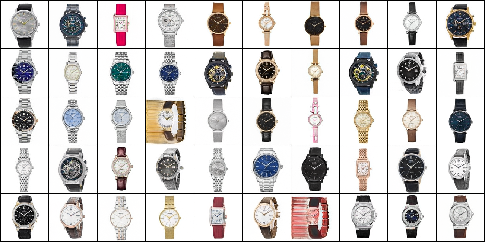

API command here: "kaggle datasets download -d minhquntntht/wrist-watch-128"
```bash
kaggle datasets download -d minhquntntht/wrist-watch-128
```
The dataset contains over 15,524 listings of luxury watches images scarapped from vuahanghieu.com.

Model

Vấn đề khó khăn khi train mô hình GAN và nhưng hướng giải quyết

- Non-convergence: Một trong hai model (hoặc cả 2) không hội tụ. Khi đó thì chắc chắn quá trình train GAN là thất bại. Khi đó, có thể do các lý do sau: 
    - Dữ liệu không chuẩn, unbalance.
    - Model quá tệ, quá cơ bản, quá phức tạp, không phù hợp
    - Dữ liệu quá thiếu, bị nhiễu
    - Overfit, underfit

- Mode collapse: Có một hiện tượng rất phổ biến: fake_images sinh ra giống hệt nhau, ít phụ thuộc vào input đầu vào. Điều này xảy ra khi mà generator tìm ra một điểm dữ liệu đặc biệt mà tại điểm đó discriminator không thể phân biệt được.

- Dimished gradient: Hiện tượng này xảy ra khi discriminator hội tụ quá nhanh (hiện tượng này xảy ra cực kì phổ biến do tại những step đầu tiên, ảnh thật và ảnh fake khác nhau rất nhiều). Ngay những epoch đầu tiên nó đã nhận biết được thật giả. Điều này gây ra hiện tượng gradient vanishes cho generator khiến cho generator học rất chậm, hoặc chẳng học được gì nên quá trình train thất bại.

- Nhạy cảm với hyper parameters: Do GAN là kết hợp giữa hai model nên việc train song song 2 model này rất khó và nhạy cảm bởi các tham số như learning, các hyper parameter trong optimizer ...

Phương pháp cải thiện:
Chiến lược train: Khi train, nên trên theo minibatch trong từng step. Trong 1 batch, không nên chứa lẫn lộn real_image, fake_image mà lần lượt real_image trước, fake_image sau.
Chọn model: Đôi khi do model của bạn quá đơn giản, quá phức tạp nên khả năng của model không được cải thiện. Thường người ta xây dựng DCGAN - tức generator và discriminator là 2 Deep Convolution có kiến trúc điển hình. Nếu train mà mãi không thành công, có thể nghĩ tới việc thêm, bớt các layer, các nhánh. Ví dụ với bộ mnist đơn giản, chỉ cần 3, 4 layer Conv trong khi với bộ Face thì cần nhiều layer hơn, cần kết hợp các loại batchnorm, dropout, các skip connection ...
Qua thực nghiệm người ta thấy rằng:
Không nên dùng dropout trong generator, ngược lại với discriminator.
Nên dùng ConvTranspose thay vì kết hợp kiểu: Upsampling+Conv, Interpolation+Conv ...
Nên dùng hàm tanh thay cho sigmoid cho output của generator.
Nên dùng hàm Leaky Relu thay cho Relu tại các lớp Conv.

Chọn hyper parameter, optimizer: Qua thực nghiệm, người ta nhận ra trong các thuật toán optimizer, Adam thường cho kết quả tốt nhất. Ta nên chọn learning_rate có giá trị nhỏ hơn bình thường, nên chọn learning_rate bé hơn 0.0002. Với Adam, nên đổi tham số beta_1 bé hơn 0.5 thay vì để mặc đinh (0.9).
Mẹo để chọn learning_rate là dựa vào accuracy của discriminator và generator.
B1: Chọn learning_rate (nên bé hơn 0.0002)
B2: Quan sát accuracy của cả discriminator và generator, nếu 1 trong 2 accuracy này tăng quá nhanh thì model học quá nhanh gây Diminished gradient. Cần giảm learning_rate xuống
B3: Lặp đi lặp lại bước 2 cho tới khi thấy accuracy của 2 model thay đổi từ từ và đều nhau.

Thêm nhiễu vào dữ liệu.

Giả sử ta có binary label cho 4 ảnh như sau: label = [[0,1],[0,1],[1,0],[1,0]]. Để tránh việc discriminator học quá nhanh, ta có thể thêm nhiễu vào dữ liệu theo 2 cách:
Cách 1: Đảo lại giá trị label
Với tỷ lệ nhất định, (thường là 10%), người ta đảo lại giá trị nhãn cho 1 ảnh từ[0,1]→[1,0] và [1,0]→[0,1]. Cách này chính là thêm nhiễu sai vào dữ liệu. Như vậy, dù discriminator học nhanh và giỏi nhất cũng chỉ có accuracy tối đa bằng 90%.
Cách 2: Đổi giá trị nhãn thành xấp xỉ.

Thay vì dùng 2 giá trị chính xác là 0 và 1, ta nên thay đổi thành các giá trị xấp xỉ hai giá trị này. VD với label trên. ta có thể đổi lại thành label = [[0.1,0.9],[0.09,0.91],[0.95,0.05],[0.96,0.04]] . Thường thì khi code, giá trị nhiễu được thêm vào <= 0.1

PatchGAN là 1 ý tưởng cải tiến mạng discriminator của GAN tại phần output. Thay vì thiết kế mạng có output là 1 giá trị 0/1 hoặc [0,1]/[1,0], output là 1 matrix 14 * 14. Tương tự, label cho từng ảnh cũng là 1 matrix 14 * 14 có giá trị các phần tử giống hệt nhau. Việc thay đổi output mang ý nghĩa chia ảnh thành 14 * 14 phần bằng nhau (và overlap nhau). Như vậy mỗi giá trị trong output matrix 14 * 14 đaị diện cho 1 vùng local. Việc làm này giúp cho GAN dễ dàng tối ưu tới từng chi tiết.

StyleGAN2

Chọn StyleGAN2 để training vì nó giải quyết được rất nhiều vấn đề cốt lõi mà các GAN trước đó gặp phải, đồng thời cho ra ảnh chất lượng cao, ổn định và kiểm soát tốt hơn.

Evaluation metrics

FID: So sánh phân phối đặc trưng (feature distribution) của ảnh thật và ảnh được generate.

Ưu điểm

✅ Phổ biến

✅ Tương quan tốt với cảm nhận con người

✅ So sánh được GAN và Diffusion

Nhược điểm

❌ Phụ thuộc Inception model

❌ Cần nhiều ảnh (thường >5k)

IS: Ảnh tốt là classifier tự tin cao (p(y|x) rõ ràng) và đa dạng (p(y) đa dạng). 

Nhược điểm:

❌ Không so với ảnh thật

❌ Có thể cao dù ảnh không thực tế

❌ Dễ bị “lừa”

Precision/Recall cho GAN: Precision cho biết ảnh có giống thật không. Recall cho biết ảnh có đa dạng không (bao phủ hết data thật không).

|Trường hợp|Nhận xét|
|:---|:---|
|Precision cao, Recall thấp	|Mode collapse|
|Precision thấp, Recall cao	|Nhiễu, ảnh xấu|

LPIPS: Đo sự khác nhau về cảm nhận thị giác của con người. So ảnh gốc và ảnh generated / reconstructed. Dùng mạng deep features
SSIM/PSNR (không dùng cho GAN thuần): Dùng khi: Có ground-truth. Dành cho super-resolution, denoising.

❌ Không phù hợp khi ảnh chỉ “giống về style” nhưng khác nội dung

NLL/ELBO (chỉ dùng cho Diffusion): GAN không có likelihood rõ ràng → không dùng được
Human Evaluation: Con người đánh giá: Đẹp / không đẹp. Thật / không thật. Phù hợp / không. Nhưng lâu, không được tự động.

#The comparision

|Tiêu chí|GAN|Diffusion|
|:---|:----|:----|
|Ý tưởng|Hai mạng đối kháng: Generator và Discriminator|Thêm nhiễu vào ảnh rồi học các khử nhiễu|
|Nguyên lý|Adversarial learning|Denoising + Markov chain/score matching|

Về mặt lý thuyết, thì Diffusion ổn định hơn. Gan mang tính đối kháng hơn.
    
#GAN
Cách hoạt động:
1. Lấy noise z (vector ngẫu nhiên)
2. Generator -> tạo ảnh giả
3. Discriminator -> đoán ảnh
4. Hai mạng cập nhật

Hàm loss:
z∼N(0,1)

Các vấn đề:
Mode collapse: Mode collapse là hiện tượng G chỉ sinh ra một số ít kiểu ảnh giống nhau, mặc dù dữ liệu gốc có nhiều dạng khác nhau.

#Diffusion
Cách hoạt động:
1. Foward process: Thêm nhiễu Gaussian dần dần vào ảnh
2. Reserve process: Học cách loại bỏ nhiễu
3. Sampling: Bắt đầu từ noise thuần và khử dần thành ảnh. Sinh ảnh nhiều bước.

Diffusion mạnh hơn về lý thuyết.

#Kết quả từ GANStyle2


